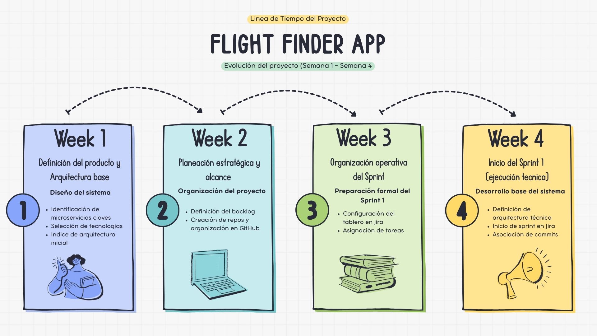

# 📋 Check-list de Avance del Proyecto – Flight Finder App  
## 📆 Semana 4 – Sprint 1 Base Técnica  

---

## 🧾 Información General

- **Proyecto:** Flight Finder App  
- **Asignatura:** Sistemas Distribuidos  
- **Sprint activo:** Sprint 1 – Base Técnica  
- **Duración del Sprint:** 20 de febrero – 2 de abril  
- **Fecha del informe:** 24/02/2026  

---

## 🕒 Línea de Tiempo del Proyecto

  

---

# ✅ Actividades Realizadas

Durante la semana 4 se completaron las actividades pendientes de la semana anterior y se inició formalmente la ejecución del Sprint 1.

---

## 📌 1. Asignación formal de Historias de Usuario

- Asignación de responsables a cada HU del Sprint 1  
- Definición de puntos de historia  
- Validación de criterios de aceptación  
- Priorización dentro del Sprint  

---

## 🚀 2. Inicio oficial del Sprint 1

- Activación del Sprint en Jira  
- Cambio de estado de tareas a **In Progress**  
- Inicio de desarrollo técnico  
- Asociación de commits a historias de usuario  

---

## 🏗️ 3. Definición técnica de arquitectura

### Backend

- Estructura por capas:
  - Controllers  
  - Services  
  - Repositories  
  - Entities  
  - DTOs  
  - Configuración  

- Aplicación de buenas prácticas REST  
- Separación clara de responsabilidades  

### Frontend

- Estructura modular en Angular  
- Organización de componentes y servicios  
- Configuración inicial de rutas  

---

## 🗄️ 4. Diseño del MER (Modelo Entidad–Relación)

- Identificación de entidades principales  
- Definición de atributos  
- Relaciones entre entidades  
- Normalización inicial  

---

# ⏳ Actividades Pendientes (Dentro del Sprint 1)

Estas actividades deben cumplirse según la fecha establecida para cada Historia de Usuario.

---

## 🔹 HU-36 – Inicialización base del proyecto  
- Finalizar revisión y aprobación  
- Validar integración completa backend–frontend  

📅 **Fecha límite:** 25 de febrero  

---

## 🔹 HU-17 – Configuración PostgreSQL  
- Configuración definitiva de base de datos  
- Pruebas de conexión  
- Persistencia inicial  

📅 **Fecha límite:** 6 de marzo  

---

## 🔹 HU-23 – Contenerización con Docker  
- Crear Dockerfile backend  
- Crear Dockerfile frontend  
- Construcción de `docker-compose.yml`  

📅 **Fecha límite:** 18 de marzo  

---

## 🔹 HU-4 – Registro de usuario  
- Desarrollo del endpoint de registro  
- Validaciones  
- Persistencia en base de datos  
- Integración con frontend  

📅 **Fecha límite:** 31 de marzo  

---

# 🔜 Próximas Actividades (Semana 5)

- Cierre formal de HU-36  
- Implementación técnica de PostgreSQL  
- Construcción física de la base de datos  
- Inicio de dockerización del backend  
- Pruebas iniciales de integración  

---

# 📊 Estado General del Proyecto

| Área | Estado |
|------|--------|
| Sprint 1 | 🚀 En ejecución |
| Arquitectura base | ✅ Definida |
| MER | ✅ Diseñado |
| Desarrollo funcional | 🔄 En progreso |
| Infraestructura completa | ⏳ En desarrollo |

---

# 🧩 Conclusión

Durante la semana 4 el proyecto avanzó de una fase de planificación a una fase de ejecución formal del Sprint 1.

Se completaron las actividades organizativas pendientes y se inició el desarrollo técnico del sistema, manteniendo el cumplimiento por fechas individuales de cada Historia de Usuario y asegurando la trazabilidad entre Jira y GitHub.